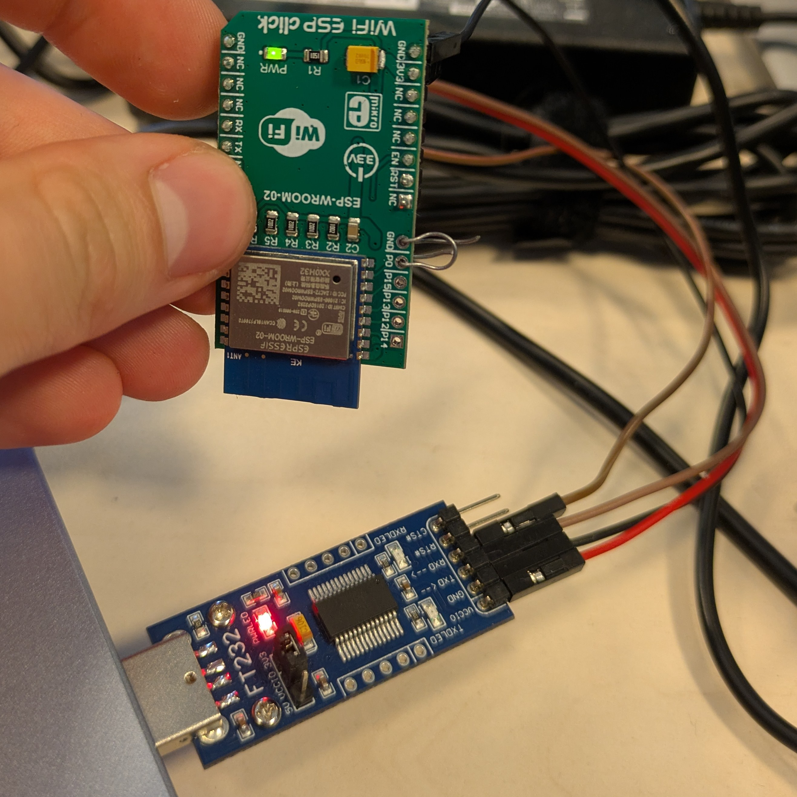

# Flashing new firmware

The wifi esp click card needs to be updated with different firmware that
redirects UART pins to work with CROSSCON setup.

## Symptoms

The symptoms of invalid firmware behavior is shown below.

```text
[00:00:00.000,000] <inf> wifi_esp_at: DT has external_reset                         
[00:00:00.000,000] <inf> wifi_esp_at: Waiting for interface to come up by itself... 
[00:00:03.001,000] <inf> wifi_esp_at: Result: -11                                   
[00:00:03.001,000] <inf> wifi_esp_at: ESP_AT: sending RST CMD                       
[00:00:03.231,000] <inf> wifi_esp_at: Waiting for interface to come up              
[00:00:03.394,000] <inf> wifi_esp_at: AT version: 1.6.2.0(Apr 13 2018 11:10:59)     
[00:00:03.396,000] <inf> wifi_esp_at: SDK version: 2.2.1(6ab97e9)                   
[00:00:03.767,000] <err> modem_cmd_handler: command AT+CWMODE=0 ret:-5              
[00:00:03.767,000] <err> wifi_esp_at: Init failed -5                                
[00:00:13.231,000] <err> wifi_esp_at: Timeout waiting for interface                 
*** Booting Zephyr OS build v4.1.0-1222-g271047d959e9 ***                           
[00:00:13.232,000] <inf> MAIN: Hello in WiFi App!                                   
[00:00:13.232,000] <inf> MAIN: Connecting to Wi-Fi network 3mdeb_abr...             
[00:00:13.232,000] <err> MAIN: Failed to connect to Wi-Fi network: -115             
```

## Flashing

Here are the steps to flash the card with new firmware.

1. Install esptool

    ```bash
    pip install esptool
    ```

1. Clone the repo with alternative firmware

    ```bash
    git clone https://github.com/CytronTechnologies/esp-at-binaries.git && \
    cd esp-at-binaries
    ```

1. Connect `TX`, `RX`, `GND`, and `3v3` pins to the USB-UART adapter. Make sure
the adapter is set to output 3.3v. Jump P0 and GND pins together while
connecting the device to enter bootloader mode.


1. Check if the device is detected.

    ```bash
    mkusiak in ~/Downloads/esp-at-binaries on main λ esptool.py --chip auto --port /dev/ttyUSB0 chip_id
    ```

    Result:

    ```text
    esptool.py v4.8.1
    Serial port /dev/ttyUSB0
    Connecting....
    Detecting chip type... Unsupported detection protocol, switching and trying again...
    Connecting...
    Detecting chip type... ESP8266
    Chip is ESP8266EX
    Features: WiFi
    Crystal is 26MHz
    MAC: bc:ff:4d:42:37:11
    Uploading stub...
    Running stub...
    Stub running...
    Chip ID: 0x00423711
    Hard resetting via RTS pin...
    ```

1. Establish flash size.

    ```bash
    esptool.py --chip auto --port /dev/ttyUSB0 flash_id
    ```

    Result:

    ```text
    esptool.py v4.8.1
    Serial port /dev/ttyUSB0
    Connecting...
    Detecting chip type... Unsupported detection protocol, switching and trying again...
    Connecting...
    Detecting chip type... ESP8266
    Chip is ESP8266EX
    Features: WiFi
    Crystal is 26MHz
    MAC: bc:ff:4d:42:37:11
    Stub is already running. No upload is necessary.
    Manufacturer: 68
    Device: 4016
    Detected flash size: 4MB
    Hard resetting via RTS pin...
    ```

1. Backup stock firmware. Do this at least two times and compare checksums.

    ```bash
    esptool.py --chip auto --port /dev/ttyUSB0 --baud 115200 read_flash 0x00000 0x400000 backup_firmware_2nd_attempt.bin
    ```

    Result:

    ```text
    esptool.py v4.8.1                                          
    Serial port /dev/ttyUSB0                                   
    Connecting...                                              
    Detecting chip type... Unsupported detection protocol, switching and trying again...
    Connecting...                                              
    Detecting chip type... ESP8266
    Chip is ESP8266EX                                          
    Features: WiFi                                             
    Crystal is 26MHz                                           
    MAC: bc:ff:4d:42:37:11                                     
    Stub is already running. No upload is necessary.
    Configuring flash size...                                  
    4194304 (100 %)                                            
    4194304 (100 %)                                            
    Read 4194304 bytes at 0x00000000 in 393.8 seconds (85.2 kbit/s)...
    Hard resetting via RTS pin...
    mkusiak in ~/Downloads/esp-at-binaries on main λ md5sum backup_firmware_2nd_attempt.bin 
    4e7918aec3863eeaeeb01c515bb0a1fb  backup_firmware_2nd_attempt.bin
    mkusiak in ~/Downloads/esp-at-binaries on main λ md5sum backup_firmware.bin 
    4e7918aec3863eeaeeb01c515bb0a1fb  backup_firmware.bin
    ```

1. Flash new firmware.

    ```bash
    esptool.py --chip auto --port /dev/ttyUSB0 --baud 115200 --before default_reset --after hard_reset write_flash -u --flash_mode dio --flash_freq 40m --erase-all 0x0 Cytron_ESP-12F_WROOM-02_AT_Firmware_V2.2.0.bin
    ```
