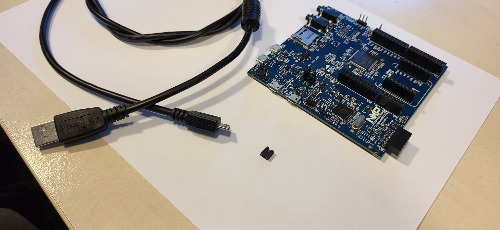
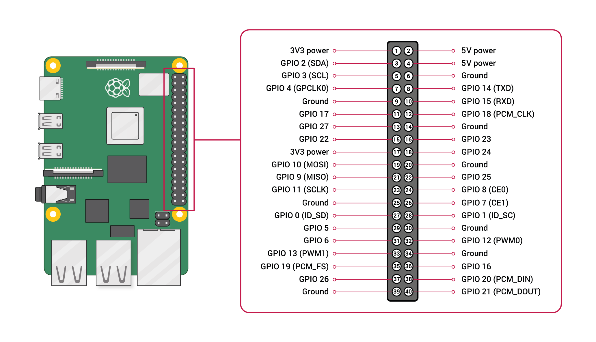
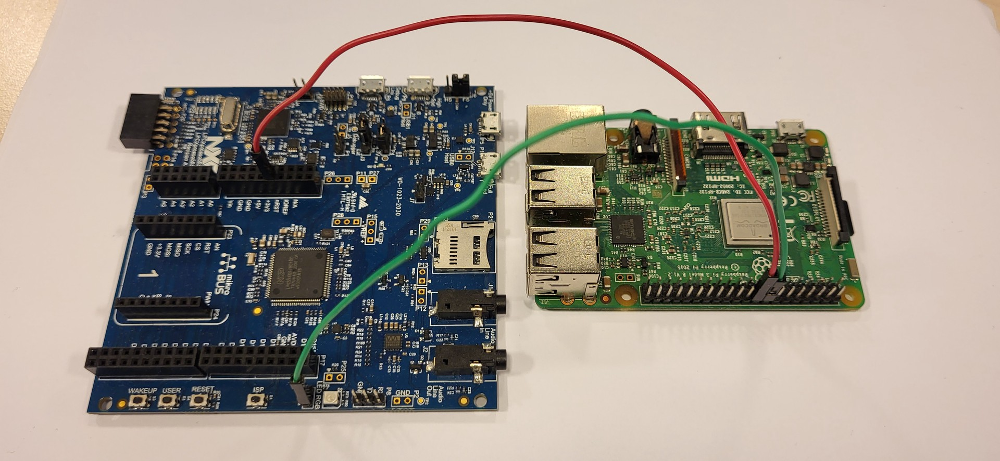

# LPCXpresso55s69 Flashing Guide

## Prerequisites

1. LPCXpresso55s69 board
1. USB Type A to USB Type Micro B cable
1. (Optional) jumper
1. Raspberry Pi board
1. jumper wires



## Board Diagram

This image shows every board part (buttons, links, jumpers) that we will need
for this guide:


## Connect Raspberry Pi to LPCXpresso board

Every Raspberry Pi board has following GPIO layout (*1):



### Connect the cables

To enable control of the LPCXpresso board, we need 2 GPIO pins: one for
controlling the bootloader state, and one for resetting the board.

In this example pins `GPIO 23` and `GPIO 24` will be used accordingly.

1. Connect the `GPIO 23` pin from the Raspberry Pi board to the right `J10` pin
   on the LPCXPresso board.

1. Connect the `GPIO 24` pin from the Raspberry Pi board to the `nRST` on the
   LPCXPresso board.



In this example, `GPIO 23` is connected via the `Green` cable, and `GPIO 24` via
the `Red` one.

### Control commands

Now it is possible to control the state of the board via GPIO pins. The state of
the pins can be changed via the `pinctrl` program on the Raspberry Pi board.

1. Reset the board:

    To reset the board, we need to output `HIGH` to `GPIO 24` (`nRST`) for
    around a second:

    ```bash
    sudo pinctrl set 24 op && sleep 1 && sudo pinctrl set 24 ip
    ```

1. Enable bootloader:

    To make the board go into the bootloader state on boot, we need to output
    `LOW` to the `GPIO 23` (right `J10` pin):

    ```bash
    sudo pinctrl set 23 op pd
    ```

1. Disable bootloader:

    To make the board boot normally, we need to `INPUT` on pin `GPIO 23` (right
      `J10` pin):

    ```bash
    sudo pinctrl set 23 in
    ```

## Compile the lpc55-host tool

1. Clone the repository:

    ```bash
      git clone https://github.com/lpc55/lpc55-host
    ```

1. Enter the cloned directory:

    ```bash
      cd lpc55-host
    ```

1. Compile the tool:

    ```bash
      cargo install --locked --path .
    ```

## Set udev rules

For the lpc55 to work without root, it is needed to setup specific udev rules.

1. Create a file for example 50-nxp.rules containing following rules:

    ```text
    SUBSYSTEM=="hidraw", ATTRS{idVendor}=="1fc9", ATTRS{idProduct}=="0021", MODE="0666"
    ```

1. Copy the file to `/etc/udev/rules.d`:

    ```bash
    sudo cp 50-nxp.rules /etc/udev/rules.d
    ```

1. Reload rules:

    ```bash
    sudo udevadm control --reload-rules
    sudo udevadm trigger
    ```

Now it should be possible to detect the bootloader under any user, not just
root.

## Flashing the board

This section covers flashing our built application onto the board.

1. Place the jumper on the J10 slot. Alternatively, with the board connected to
   a power source, press and hold the ISP button before pressing the RESET
   button.

1. Connect miniUSB to the P9 (high speed) link.

1. Display board bootloader:

    ```bash
      lpc55 ls

      bootloaders:
      Bootloader { vid: 1FC9, pid: 0021, uuid: E169A5B43A3F7C56B8F8D443B9772E4A }
    ```

1. Flash the board:

    ```bash
      lpc55 write-flash </path/to/zephyr.bin>
    ```

**At this point, the board should be successfully flashed with our image.**

## Running the application

To see the "Hello World" message from our board, we need to start it in the
application mode.

1. Power off the board by disconnecting the USB cable.

1. Take off the jumper from the J10 slot.

1. Start the `dmesg` in the watch mode:

    ```bash
      sudo dmesg -w
    ```

1. Connect the board with the P6 (debug link).

    Example dmesg output:

    ```bash
      [181776.794861] usb 1-2: new high-speed USB device number 27 using xhci_hcd
      [181776.918705] usb 1-2: New USB device found, idVendor=1366, idProduct=1024, bcdDevice= 1.00
      [181776.918716] usb 1-2: New USB device strings: Mfr=1, Product=2, SerialNumber=3
      [181776.918720] usb 1-2: Product: J-Link
      [181776.918723] usb 1-2: Manufacturer: SEGGER
      [181776.918726] usb 1-2: SerialNumber: 000729594341
      [181776.920235] cdc_acm 1-2:1.0: ttyACM0: USB ACM device
    ```

    It shows `ttyACM0: USB ACM device`, therefore we should use `/dev/ttyACM0`.

1. Connect to the board via `minicom`:

    ```bash
      sudo minicom -D /dev/ttyACM0 -b 115200
    ```

1. Push the RESET button on the board.

1. Finally, in the `minicom` terminal, we can see the output from our
   application:

    ```bash
      *** Booting Zephyr OS build v4.1.0-rc1-35-gc031e127b0fd ***
      Hello World! lpcxpresso55s69/lpc55s69/cpu0
    ```

## Credits

(*1) - GPIO-Pinout-Diagram-2 (Original)
(<https://github.com/raspberrypi/documentation/blob/develop/documentation/asciidoc/computers/raspberry-pi/images/GPIO-Pinout-Diagram-2.png>).
Raspberry Pi Ltd. Licensed under "CC-BY-SA-4.0".
